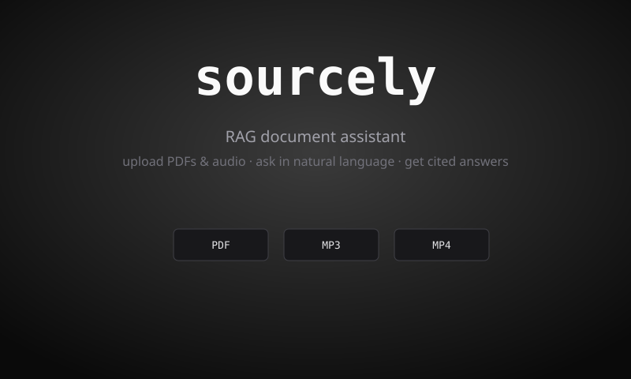
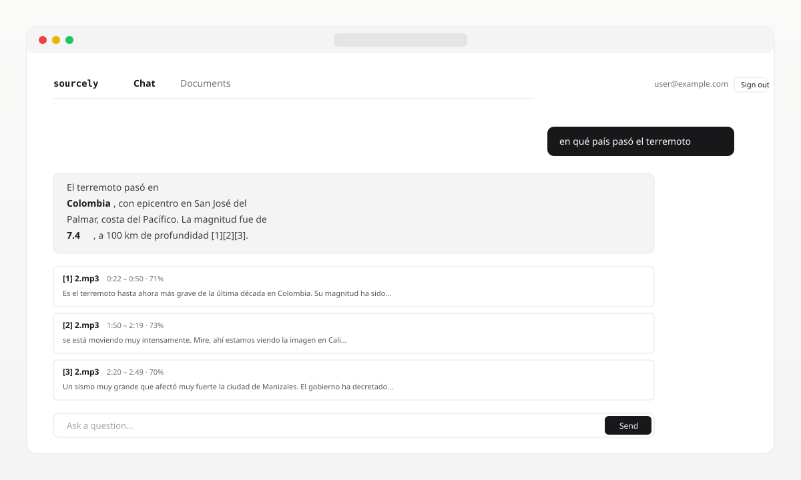
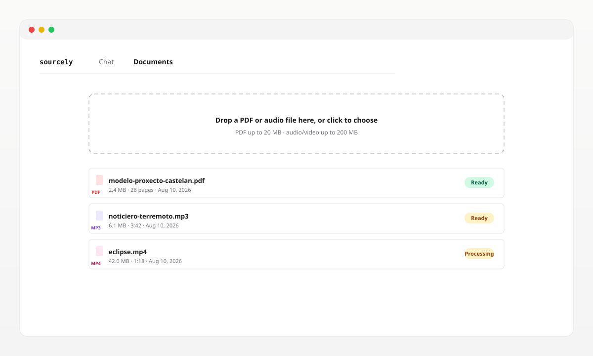
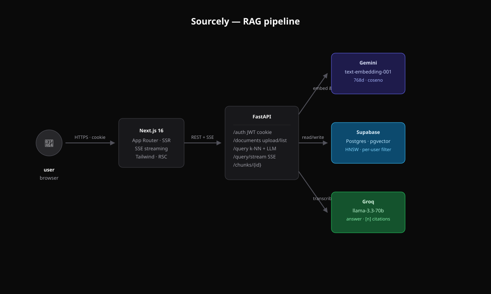

# Sourcely

> Haz preguntas sobre tus propios PDF y audios. Obtén respuestas citadas con marcadores `[1]` `[2]` que enlazan directamente con la fuente.



[](LICENSE)
[](https://nextjs.org)
[](https://fastapi.tiangolo.com)
[](https://www.typescriptlang.org)
[](https://python.org)
[](https://supabase.com)

---

## 💡 Resumen

Sourcely es un asistente RAG (Retrieval-Augmented Generation) completo que puedes ejecutar en tu propio equipo. Subes una mezcla de PDF y ficheros de audio, formulas una pregunta en lenguaje natural y el sistema recupera los *chunks* más relevantes, genera una respuesta fundamentada y cita cada afirmación devolviéndola al número de página o al segundo exacto del audio donde se encontró.

El proyecto abarca todo el pipeline: ingesta (parseo de PDF, transcripción de audio con `whisper.cpp`), troceado (*chunking*), *embeddings* (`gemini-embedding-001`, 768 dim, similitud coseno sobre `pgvector` HNSW), recuperación con filtro por usuario, y generación de respuesta (`llama-3.3-70b` en Groq) enviada al navegador mediante *streaming* por Server-Sent Events.



## ✨ Funcionalidades

- **📄 Ingesta multiformato** — PDF (`pypdf`) y audio/vídeo (mp3, wav, m4a, flac, ogg, mp4, webm, mov) a través de un único `POST /api/v1/documents/upload`. La validación se hace por *magic bytes*, no por el MIME declarado.
- **🔍 Recuperación semántica** — *embeddings* de Gemini a 768 dim con `RETRIEVAL_DOCUMENT` al indexar y `RETRIEVAL_QUERY` al consultar. Índice HNSW con distancia coseno.
- **👤 Aislamiento por usuario** — cada lectura de *chunks* se filtra por `documents.user_id` en la capa SQL. El usuario A nunca puede ver los *chunks* del usuario B, ni con un *prompt* manipulado.
- **🧠 Respuestas fundamentadas con citas** — el *system prompt* obliga a "responder solo del contexto, citar `[1]` `[2]`". Sin datos inventados, sin alucinaciones silenciosas.
- **⚡ Respuestas en *streaming*** — `POST /api/v1/query/stream` empuja *tokens* por SSE mientras el modelo los produce. La interfaz muestra el cursor y concatena los *tokens* en directo.
- **🎯 Enlace directo a la fuente** — cada tarjeta de cita lleva un botón de *deep link*: para PDF abre la URL firmada con `#page=N`; para audio asigna el `currentTime` del elemento `<audio>` al `start_seconds` del *chunk* y comienza la reproducción.
- **🔎 Resaltado en la cita** — la tarjeta de fuente resalta dentro del texto del *chunk* las palabras de tu pregunta, para que veas de un vistazo por qué se recuperó ese pasaje.
- **📊 *Ranking* por *score*** — cada resultado de la recuperación lleva un *score* de similitud coseno mostrado como porcentaje. Un umbral configurable `MIN_SCORE` descarta *chunks* por debajo de la relevancia y evita contexto ruidoso.
- **🛡 Autenticación con JWT en cookie** — `HttpOnly`, `SameSite=Lax`, caducidad de 7 días. `get_current_user` vuelve a comprobar la fila de usuario en cada petición, de modo que un usuario borrado queda bloqueado de inmediato.
- **🌗 Claro y oscuro** — tema tokenizado mediante *script* en línea (sin parpadeo en la primera pintura), persistido en `localStorage`.
- **🔔 Avisos con Sonner** — subidas, borrados y errores aparecen como avisos efímeros en lugar de como modales.



## 👩‍💻 Stack

- **Next.js 16** con App Router y Turbopack. *Server Components* para la capa autenticada, *client components* solo para el chat y la zona de arrastre.
- **TypeScript 5** en modo *strict*.
- **Tailwind v4** con `@theme inline` para exponer variables CSS como *utilities* y un *variant* personalizado para la clase `dark`.
- **Sonner** para los avisos.
- **FastAPI** con SQLAlchemy 2 *async* y `asyncpg`.
- **pgvector** sobre Supabase para búsqueda por similitud con índice HNSW.
- **Alembic** para migraciones de esquema.
- **Gemini** (`text-embedding-001`) para *embeddings*, **Groq** (`llama-3.3-70b-versatile`) para la generación.
- **whisper.cpp** mediante los *bindings* de Python `faster-whisper` para la transcripción de audio.
- **Supabase Storage** para almacenamiento privado de los ficheros originales; las descargas se hacen a través de URL firmadas.
- **Pytest** (backend) y **Vitest + Testing Library** (frontend) para los tests.

## 🏗 Arquitectura



El navegador habla con Next.js, que envía todo a FastAPI a través de un único origen CORS. El backend se ocupa de tres tareas: deriva los *embeddings* y guarda los *chunks* con clave foránea al documento del usuario, ejecuta búsqueda por similitud filtrada por `user_id`, y pide al LLM una respuesta con citas. El audio usa la misma tabla de *chunks* pero guarda `start_seconds` / `end_seconds` en lugar del número de página.

## 📖 Fuentes y APIs

- **[Gemini Embeddings](https://ai.google.dev/)** — `text-embedding-001`, plan gratuito ~1500 peticiones/día.
- **[Groq](https://console.groq.com/)** — `llama-3.3-70b-versatile` para inferencia rápida.
- **[Supabase](https://supabase.com/)** — Postgres administrado con `pgvector` y almacenamiento compatible con S3.
- **[faster-whisper](https://github.com/SYSTRAN/faster-whisper)** — transcripción Whisper amigable con CPU.
- **[Next.js](https://nextjs.org/)** — *server components*, *route handlers* y respuestas *streaming* compatibles con SSE.
- **[Tailwind CSS v4](https://tailwindcss.com/)** — *utilities* con tokens de tema.

## 📦 Primeros pasos

### 🚀 Requisitos

- **Python 3.11+** con `pip` y `venv`.
- **Node.js 20+** con `pnpm` (`npm install -g pnpm` si no lo tienes).
- **Postgres 15+** con la extensión `vector`, **o bien** un proyecto en Supabase (el plan gratuito sirve) con `vector` activado desde el editor SQL.
- API keys de **Gemini** (gratis) y **Groq** (plan gratuito).

### 🛠 Instalación

```bash
# 1. Clonar
git clone https://github.com/<tu-usuario>/sourcely.git
cd sourcely

# 2. Backend
cd backend
python -m venv .venv
# Windows:
.venv\Scripts\activate
# macOS / Linux:
# source .venv/bin/activate
pip install -r requirements.txt
cp .env.example .env
# Rellenar DATABASE_URL, GEMINI_API_KEY, GROQ_API_KEY y las SUPABASE_*.

alembic upgrade head
uvicorn app.main:app --reload --port 8000

# 3. Frontend (en otra terminal)
cd ../frontend
cp .env.local.example .env.local
pnpm install
pnpm dev
```

> Abre `http://localhost:3000`. El *frontend* habla con el *backend* en `http://localhost:8000`.

### 📃 Documentación de la API

FastAPI genera documentación OpenAPI automáticamente:

- Swagger UI: `http://localhost:8000/docs`
- ReDoc: `http://localhost:8000/redoc`

Endpoints principales:

| Método | Path                                 | Auth       | Descripción                                                |
| ------ | ------------------------------------ | ---------- | ---------------------------------------------------------- |
| POST   | `/api/v1/auth/register`              | —          | Crea cuenta, devuelve el usuario.                          |
| POST   | `/api/v1/auth/login`                 | —          | Establece la cookie `token`, devuelve el usuario.          |
| POST   | `/api/v1/auth/logout`                | —          | Borra la cookie `token`.                                   |
| GET    | `/api/v1/auth/me`                    | requerido  | Devuelve el usuario actual.                                |
| POST   | `/api/v1/documents/upload`           | requerido  | Subida *multipart*, PDF/audio/vídeo ≤ 200 MB.              |
| GET    | `/api/v1/documents`                  | requerido  | Lista los documentos del usuario.                          |
| GET    | `/api/v1/documents/{id}`             | requerido  | Un documento + URL firmada.                                |
| GET    | `/api/v1/documents/{id}/chunks/{id}` | requerido  | Texto completo del *chunk* con campos de ubicación.         |
| DELETE | `/api/v1/documents/{id}`             | requerido  | Borrado físico de la fila y del objeto en almacenamiento.    |
| POST   | `/api/v1/query`                      | requerido  | Recuperación + respuesta del LLM (una respuesta JSON).     |
| POST   | `/api/v1/query/stream`               | requerido  | Igual, pero los *tokens* llegan por SSE.                   |

## ▶️ Uso

1. Abre `http://localhost:3000` y pulsa en `Create one` para registrarte.
2. Tras iniciar sesión aterrizas en `/chat`. Abre `/documents` y suelta un PDF o audio en la zona de puntos (o pulsa para elegir uno).
3. Espera a que la etiqueta de estado de la fila pase a `Ready` (ejecuta el *embedding* / la transcripción en segundo plano).
4. Vuelve a `/chat` y formula una pregunta. La respuesta se muestra en *streaming*; cada `[n]` del texto se corresponde con una tarjeta de cita numerada debajo.
5. Pulsa en `↳ view p. X` para abrir el PDF en esa página, o en `↳ jump to m:ss` para reproducir el audio desde el segundo citado.

### ✔ Consejos

- El umbral de recuperación (`MIN_SCORE = 0.45` en `backend/app/services/retrieval.py`) descarta *chunks* no relacionados. Redúcelo si recibes pocas citas, auméntalo si llegan resultados ruidosos.
- El *frontend* usa `NEXT_PUBLIC_API_URL` para localizar al *backend*. En Windows, si el puerto `:8000` lo retiene un *socket* zombi, lanza *uvicorn* en otro puerto y actualiza la variable de entorno.
- El conmutador de tema claro/oscuro está en la esquina inferior derecha de cada página; la preferencia se guarda en `localStorage` y se aplica antes de la hidratación para evitar parpadeos.

## 🧪 Tests

### Backend (pytest)

```bash
cd backend
pytest                               # tests unitarios, 73 casos, todos en memoria
RUN_INTEGRATION=1 pytest tests/integration/   # ataca a Gemini + Groq + Supabase reales
```

La *suite* de integración es opcional y cuesta ~$0,0001 por ejecución. Úsala antes de los despliegues.

### Frontend (vitest)

```bash
cd frontend
pnpm test          # ejecución única
pnpm test:watch    # modo watch
```

Seis tests cubren la superficie crítica: `SourceCard` para el renderizado de PDF/audio/en reproducción y el comportamiento del botón de parada, `ChatClient` para *tokens* en *streaming* y caminos de error, y `DocumentsClient` para rechazar tipos de fichero no admitidos.

## 🗺 Hoja de ruta

- **Conversaciones** — historial multiturno con hilos nombrados. Los *endpoints* `POST /api/v1/conversations`, `POST /api/v1/conversations/{id}/messages` ya existen en *scaffolding*.
- **Endpoint de reindexado** — `POST /api/v1/documents/{id}/reindex` para reconstruir *embeddings* sin volver a subir el fichero.
- **Rerank** — *cross-encoder* de segunda etapa (p. ej. `bge-reranker`) para mejorar la precisión del top-N.
- **OAuth** — inicio de sesión con Google además de con correo y contraseña.
- **i18n** — *strings* de la interfaz extraídos; el LLM ya responde en el idioma del usuario.

## 🤝 Contribuir

Las contribuciones son bienvenidas. Flujo resumido:

1. **Haz un *fork*** y crea una rama (`git checkout -b feat/algo`).
2. Ejecuta las suites de tests localmente: `pytest` en `backend/`, `pnpm test` en `frontend/`.
3. Mantén los *commits* enfocados. Respeta el estilo existente — *async-first* en el *backend*, *server components* por defecto en el *frontend*.
4. Abre una **pull request** describiendo qué has cambiado y por qué. Si tocas la superficie de la API, actualiza la tabla de *endpoints* del README.

## 🐛 Incidencias

Si algo no funciona o quieres una funcionalidad, abre una incidencia con:

- Un título claro y un resumen de un párrafo.
- Pasos para reproducir (con comandos `curl` o capturas, si procede).
- *Logs* del servicio correspondiente (*backend*: salida de `uvicorn`; *frontend*: consola + pestaña Red de DevTools).
- Entorno: SO, versión de Python, versión de Node, navegador.

## 📜 Licencia

Distribuido bajo la Licencia MIT. Consulta [`LICENSE`](LICENSE) para el texto completo.

<div align="center">

<sub>Construido con FastAPI · Next.js · pgvector · whisper.cpp · Gemini · Groq</sub>

</div>
